# AutoFaszination Performance & B2B Sales Suite — V4.1 «Carbon Cockpit»

**Die digitale Mitarbeiter-Plattform für die LET26-Produktlinie im Schweizer Markenhäuser-Netz —
komplett neu gestaltet als dunkles Premium-Cockpit.**

Entwickelt für die Schnell & Friends GmbH (AutoFaszination), Neuenhof AG —
Mitarbeiter-Portal mit Fahrzeug-Konfigurator, Schweizer Offerten-PDF, B2B-Partner-Routing
und Vertriebs-Cockpit.

| Kennzahl | Wert |
|---|---|
| Markenhäuser hinterlegt (Echtdaten) | **415** |
| Fahrzeuge mit LET26-Tuning-Werten | **68** (Toyota, Peugeot, Citroën, Opel, Fiat, DS) |
| Preismodell | AF-Garagen-Preisliste CH/DE 2026 (DA / BA / K / GA) |
| MwSt.-Abrechnung | **8,1 %** separat ausgewiesen, Porto CHF 14.50 |
| Follow-up-Automatik | Tag 1 / Tag 3 / Tag 7 gem. LET26-Vertriebs-Guide |
| Design | **V4.1 «Carbon Cockpit»** — Schwarz/Rot/Silber, lokal gebündelte Schriften |

---

## Was ist neu in V4.1?

- **4 neue Module — jetzt 12 statt 8**:
  - **Termine** — Wochenkalender (2 Wochen) für Testfahrten, Einbautermine, Beratungen und
    Follow-ups mit Heute-Highlight, Typ-Filter, Wochen-Navigation und Status-Workflow
    (Geplant → Bestätigt → Abgeschlossen / Abgesagt).
  - **Werkstatt** — Auftrags-Kanban mit Status-Flow Geplant → In Arbeit → Qualitätskontrolle →
    Abgeschlossen, Fortschrittsbalken, Workflow-Stepper, Bühnen-Auslastung (2 Hebebühnen × 8 h).
  - **Rechnungen** — Offerte → Rechnung: Forderungs-KPIs (bezahlter Umsatz, offene Posten,
    Überfälliges, Ø Zahlungsdauer), Monats-Umsatz-Chart, Zahlungs-Verbuchung per Klick, Stornierung.
  - **Berichte** — Konversions-Trichter mit Raten, Deal-Velocity, Volumen/Umsatz-Diagramme,
    Top-Fahrzeuge & Top-Partner, Kanal-Performance B2C/B2B, Follow-up-Effektivität, CSV-Exporte.
- **Fahrzeug-Datenbank** — alle 68 Fahrzeuge als durchsuchbare Karten mit Vorher → Nachher-Werten,
  Marken- und Kraftstoff-Filtern sowie Detail-Drawer.
- **Command-Palette (Strg + K)** — globale Suche über Fahrzeuge, Kunden/Offerten, Partner,
  Termine und Rechnungen plus 12 Schnellaktionen, komplett per Tastatur bedienbar.
- **Live-Badges in der Navigation** — Anzahl überfälliger Follow-ups und heutiger Termine
  direkt im Seitenmenü (Auto-Refresh alle 60 Sekunden).
- **5 neue REST-Endpunkte**: `/appointments`, `/invoices`, `/workshop`, `/reports`, `/search`.
- Demo-Daten erweitert: 12 Termine, 4 Rechnungen, 6 Werkstatt-Aufträge (alle Status-Stufen).

## Was war neu in V3.1?

- **Setup für Handy & Tablet**: neuer One-Click-Starter `start-handy.sh` für Android (Termux) —
  die Suite läuft damit komplett offline direkt auf dem Handy.
- **QR-Code-Zugang für iPhone/iPad & Android**: `start-netzwerk.bat` startet die Suite im
  Netzwerkmodus am Windows-PC und zeigt einen QR-Code — mit der Handy-Kamera scannen,
  und die Suite öffnet sich auf jedem Gerät im selben WLAN (ideal für die Demo beim Chef).
- **Termux-kompatible Pakete**: `uvicorn` ohne Zusatz-Binaries — Installation auf Android robust.
- Server-Starter `run_server.py` mit neuen Optionen `--lan` (Netzwerk freigeben) und `--qr` (QR-Code).

## Was war neu in V3.0? (Redesign)

- **Komplettes Redesign** der Mitarbeiter-Oberfläche als dunkles Automotive-Cockpit:
  Tiefschwarz mit roten Glow-Akzenten, Space-Grotesk-/Inter-Typografie, animierte KPI-Karten,
  Micro-Interactions, Detail-Drawer statt Popup-Fenster, Toast-Meldungen, Skeleton-Loading.
- **Null Abhängigkeiten im Frontend**: keine Node.js-, npm- oder Internet-Installation nötig —
  Schriften, Icons (Inline-SVG) und Charts (reines SVG/CSS) sind vollständig lokal gebündelt.
  Die Suite läuft dadurch komplett offline.
- **PDF-Download repariert**: Offerten-PDFs laden jetzt zuverlässig über einen
  authentifizierten Blob-Download (statt unsicherer Token-URLs).
- **Router mit Cache-Busting**: Versionsparameter an allen Assets + No-Cache-Header für
  `index.html` — Updates werden sofort sichtbar, ohne Browser-Cache leeren zu müssen.
- **Robusteres error handling** mit deutschsprachigen Meldungen überall.

---

## Screenshots

| Login (Mitarbeiter-Portal) | Vertriebs-Cockpit |
|:---:|:---:|
| 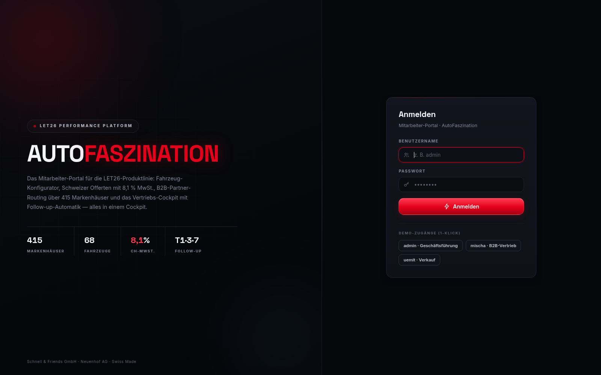 | 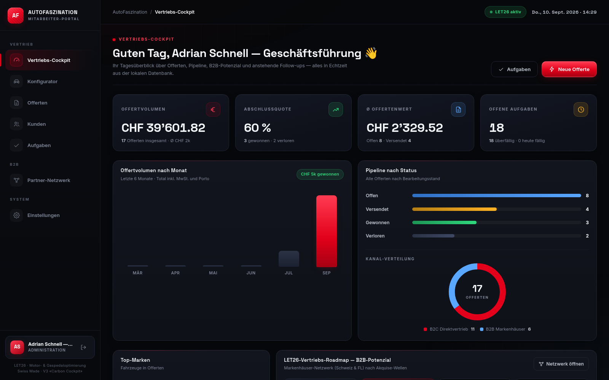 |

| Konfigurator — Fahrzeugwahl | Konfigurator — Leistungsrechner (live) |
|:---:|:---:|
| 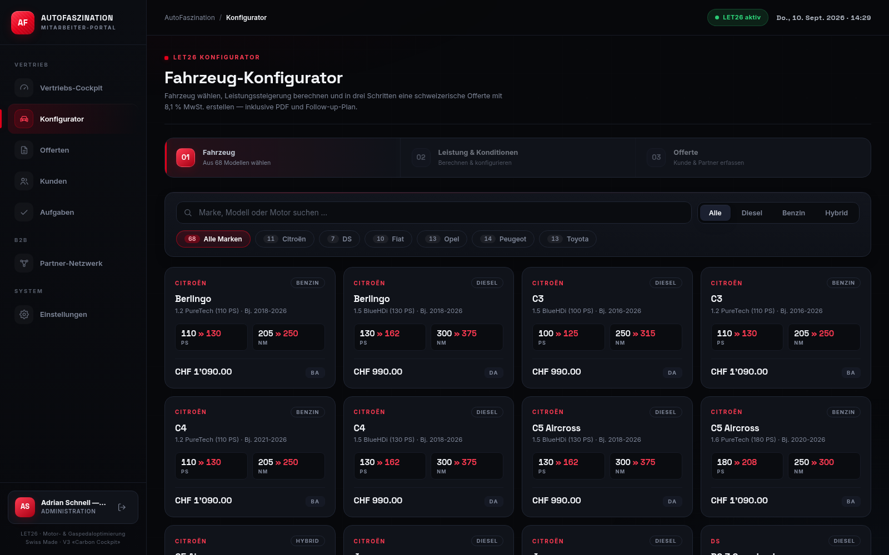 | 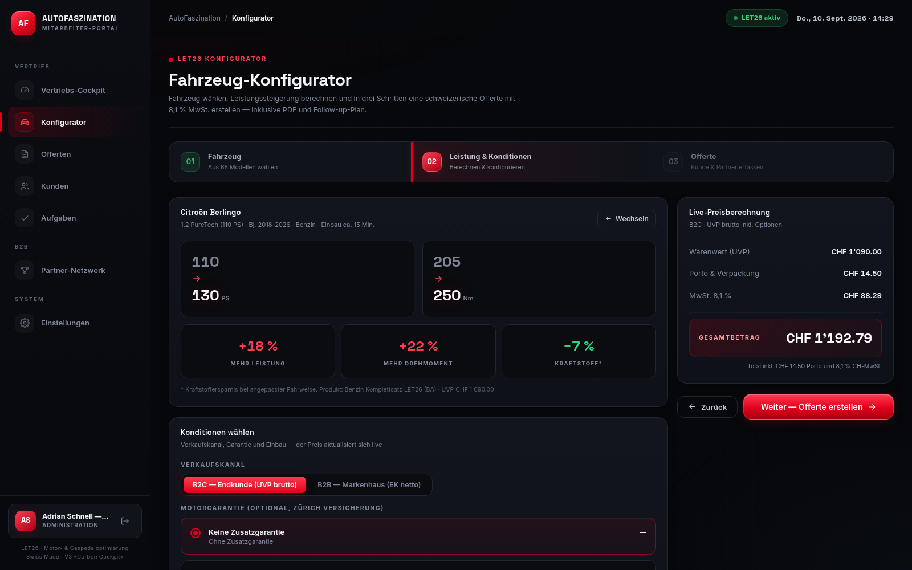 |

| Offerte erstellen | Offerte erstellt (PDF & Follow-ups) |
|:---:|:---:|
| 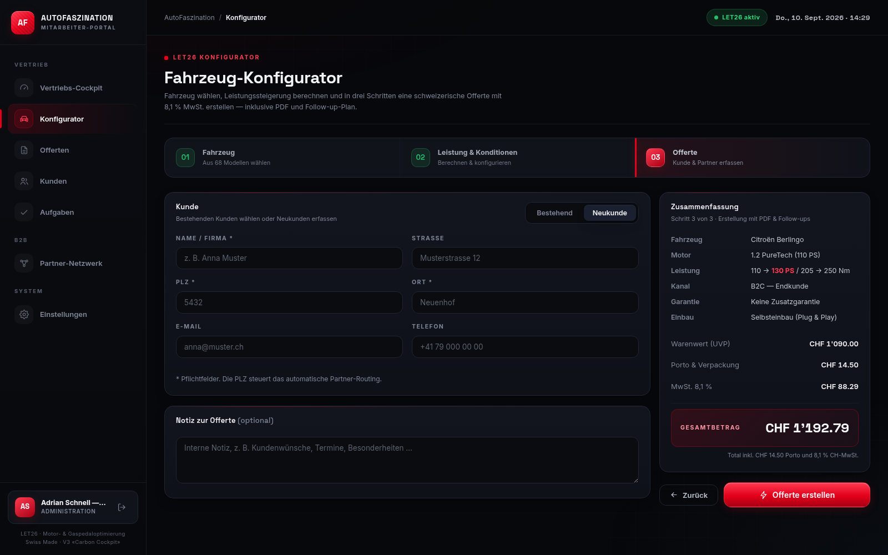 | 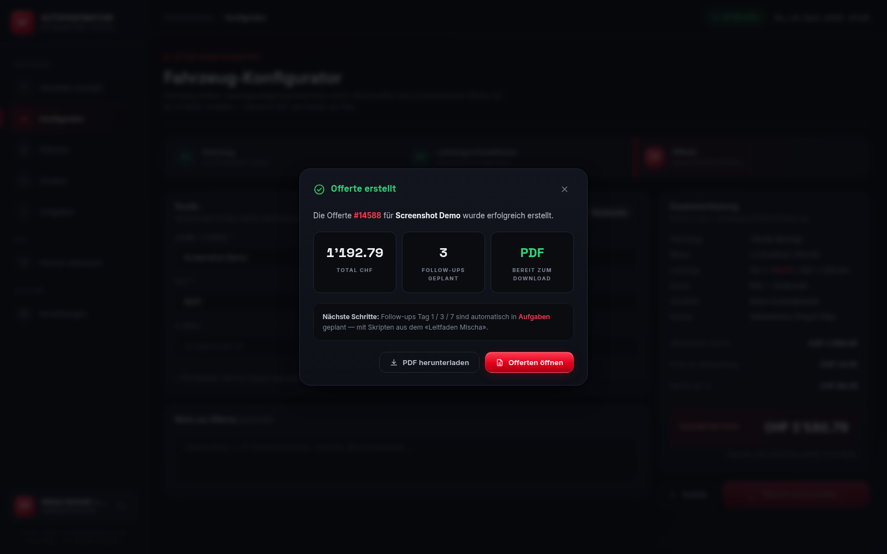 |

| Offerten-Verwaltung | Offerten-Detail (Drawer) |
|:---:|:---:|
| 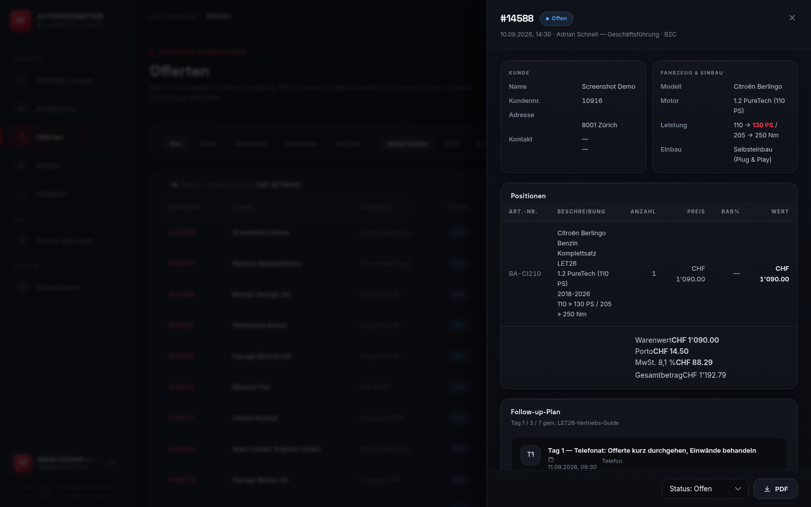 |  |

| Kunden (CRM) | Partner-Netzwerk |
|:---:|:---:|
| 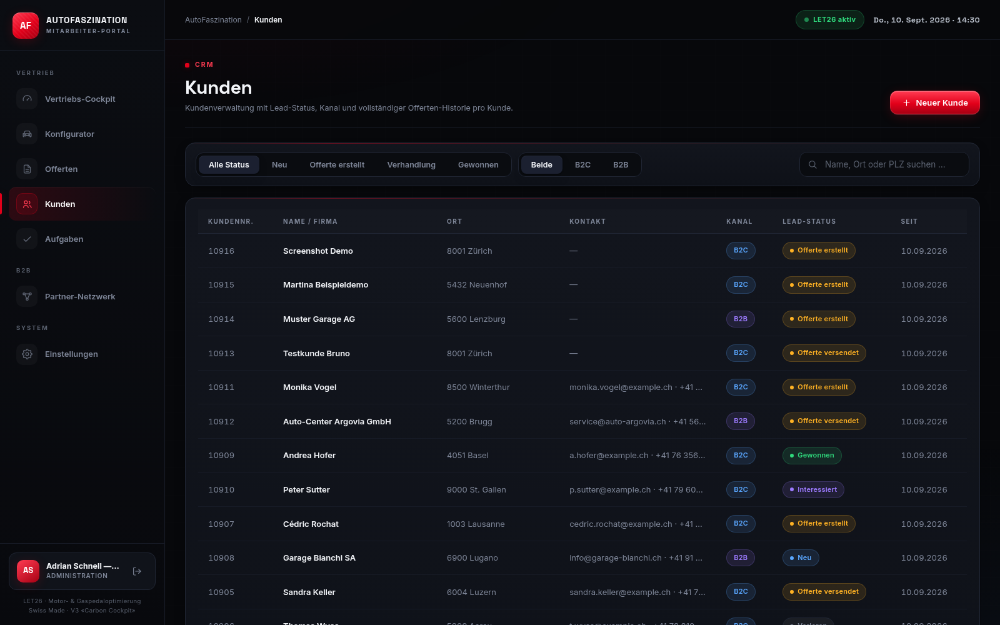 | 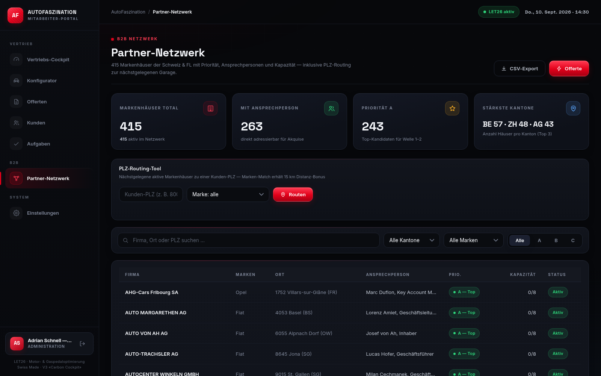 |

| PLZ-Routing | Follow-up-Aufgaben |
|:---:|:---:|
| 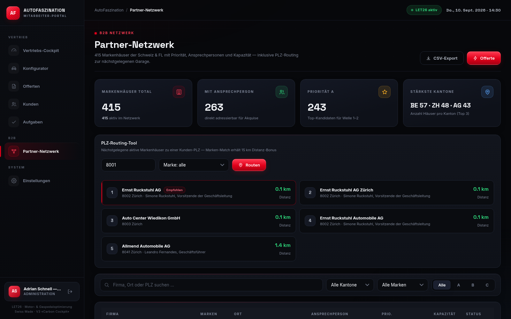 | 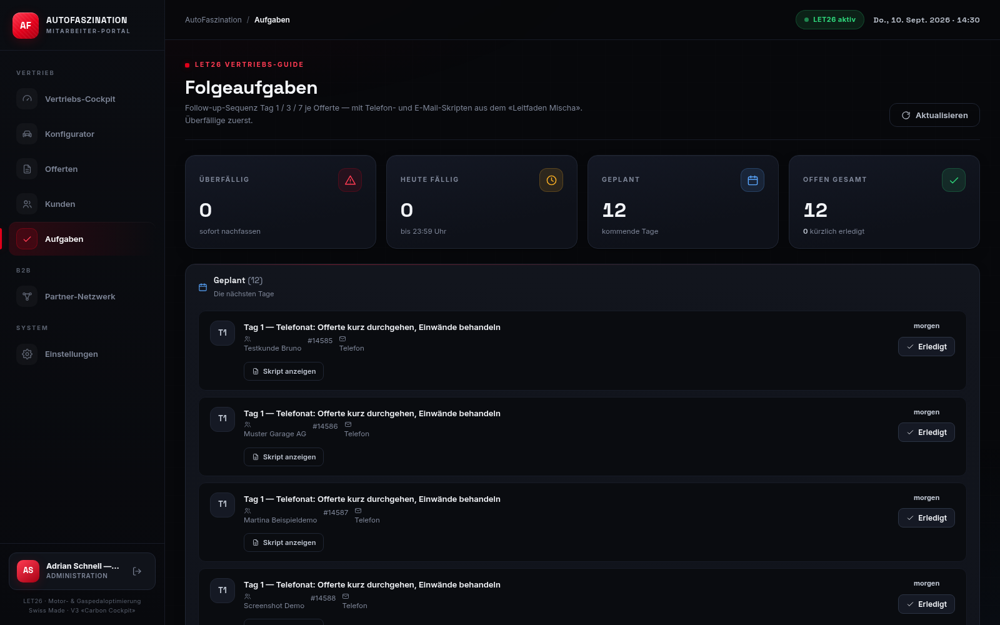 |

| Einstellungen |
|:---:|
| 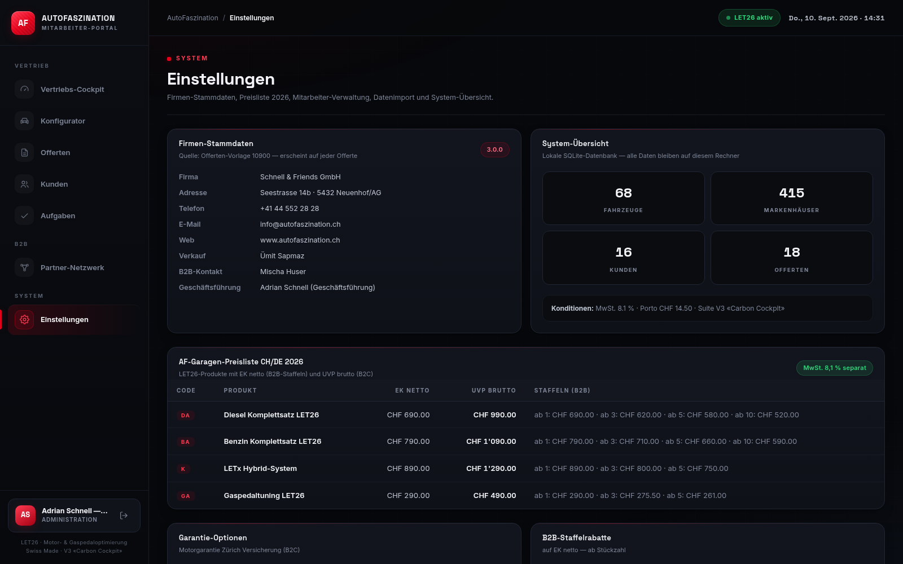 |

| Termine (Wochenkalender) *(neu V4.1)* | Werkstatt (Kanban) *(neu V4.1)* |
|:---:|:---:|
| 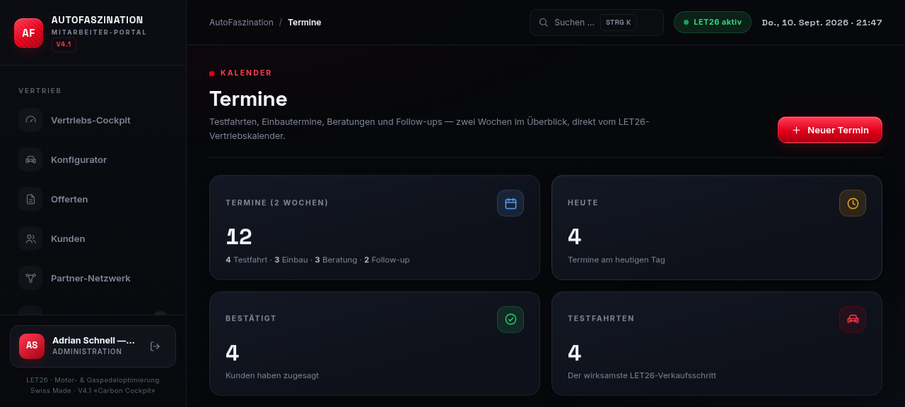 | 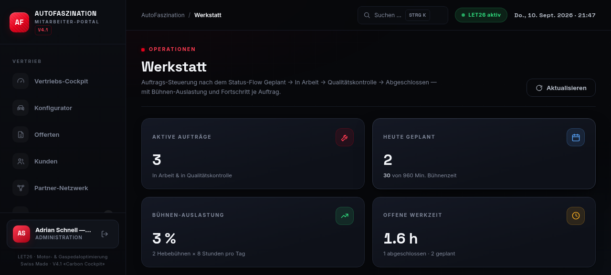 |

| Rechnungen & Forderungen *(neu V4.1)* | Berichte & Analysen *(neu V4.1)* |
|:---:|:---:|
| 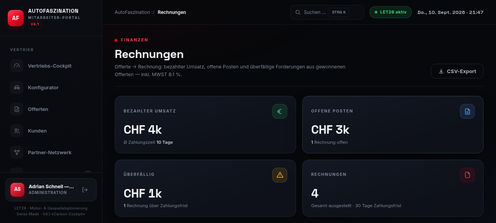 | 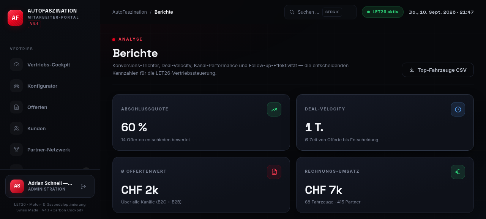 |

| Fahrzeug-Datenbank *(neu V4.1)* | Command-Palette Strg+K *(neu V4.1)* |
|:---:|:---:|
| 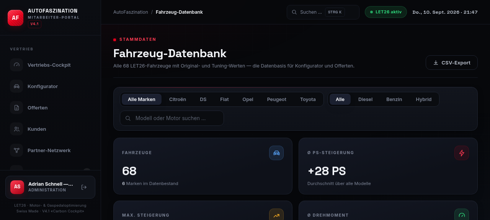 | 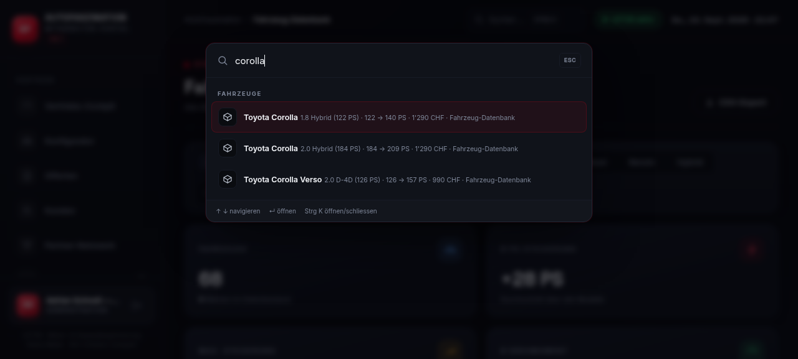 |

---

## 1. Module der Mitarbeiter-Oberfläche

| Modul | Funktion |
|---|---|
| **Cockpit (Dashboard)** | Offertvolumen CHF mit Zähl-Animation, Abschlussquote, Ø Offertenwert, offene Aufgaben, Monats-Chart, Pipeline-Balken, Kanal-Donut, Top-Marken, LET26-Roadmap-Wellen, letzte Offerten, nächste Follow-ups |
| **Konfigurator** | 3-Schritt-Wizard mit Stepper-Anzeige: Fahrzeugauswahl (68 Fahrzeuge, Suche/Marken-Chips/Kraftstoff-Filter) → Live-Leistungsrechner (PS/Nm Vorher→Nachher mit Delta-Bändern, Kraftstoffersparnis, B2C-UVP/B2B-EK mit Staffelrabatten, Garantie-Karten, Einbau-Optionen, Klebe-Preiszusammenfassung) → Offerte (Neukunde/bestehender Kunde mit Live-Suche, PLZ-Partner-Routing mit Distanz-Ranking, Notiz) — Erfolgs-Modal mit PDF-Download |
| **Offerten** | Liste mit Status-/Kanal-Filtern und Suche; Detail-Drawer mit Kunden- und Fahrzeugdaten, Positionstabelle mit Rabatten, Totals mit MwSt., Follow-up-Plan, E-Mail-Entwürfen (mit Kopieren-Button) und PDF-Download; Statuswechsel direkt im Drawer |
| **Kunden (CRM)** | Kundenverwaltung mit Lead-Status-Filter, Kanal-Filter, Suche; Neukunden-Modal; Detail-Drawer mit Stammdaten, Statusänderung, Offerten-Volumen und vollständiger Offerten-Historie |
| **Partner-Netzwerk** | KPI-Kacheln (total/aktiv/Ansprechpersonen/Priorität A), PLZ-Routing-Tool mit Distanz-Ranking und Marken-Match-Bonus (15 km), Filter nach Kanton/Marke/Priorität, Pagination, CSV-Export |
| **Aufgaben** | Follow-ups Tag 1/3/7 gruppiert nach überfällig/heute/geplant/erledigt, Telefon-/E-Mail-Skripte aus dem «Leitfaden Mischa» zum Aufklappen und Kopieren, als erledigt markieren (und wieder öffnen) — Live-Badge mit überfälligen Aufgaben direkt in der Navigation |
| **Termine** *(neu V4.1)* | Wochenkalender über 2 Wochen (Mo–So) mit Heute-Highlight, Typ-Filter (Testfahrt/Einbau/Beratung/Follow-up), Wochen-Navigation, Detail-Drawer mit Bestätigen/Abschliessen/Absagen, Neuer-Termin-Modal — Live-Badge mit heutigen Terminen in der Navigation |
| **Werkstatt** *(neu V4.1)* | Auftrags-Kanban mit 4 Status-Spalten (Geplant → In Arbeit → Qualitätskontrolle → Abgeschlossen), Fortschrittsbalken und Schnellsetzung (25/50/75/100 %), Workflow-Stepper im Detail-Drawer, Weiterstellen per Klick, Bühnen-Auslastung (2 Hebebühnen × 8 h = 960 Min./Tag) |
| **Rechnungen** *(neu V4.1)* | Forderungs-KPIs (bezahlter Umsatz, offene Posten, überfälliger Betrag, Ø Zahlungsdauer), Monats-Umsatz-Chart, Status-Tabs, Detail-Drawer mit Rekapitulation (MwSt. 8.1 %), Zahlungs-Verbuchung und Stornierung, CSV-Export |
| **Berichte** *(neu V4.1)* | Konversions-Trichter mit Stufen-Raten, Deal-Velocity (Ø Tage bis Entscheidung), Volumen/Umsatz-Diagramme, Top-Fahrzeuge und Top-Partner mit CSV-Export, Kanal-Performance B2C vs. B2B (Win-Rate, Ø Offerte), Follow-up-Effektivitäts-Vergleich (gewonnen vs. übrige) |
| **Fahrzeug-Datenbank** *(neu V4.1)* | Alle 68 LET26-Fahrzeuge als durchsuchbare Karten mit Vorher → Nachher-Werten (PS/Nm), Fortschrittsbalken der Steigerung, Marken- und Kraftstoff-Filter, Statistik-KPIs (Ø/max. Steigerung), Detail-Drawer, CSV-Export |
| **Einstellungen** | Firmen-Stammdaten, System-Übersicht, Preisliste 2026, Garantie-Optionen, B2B-Staffeln visualisiert, Mitarbeiter-Verwaltung (Rollen, Passwörter), Datenimport (Excel/JSON) — nur für Administration |

**Command-Palette (Strg + K)** — in jedem Modul verfügbar: globale Suche über Fahrzeuge,
Kunden/Offerten, Partner-Garagen, Termine und Rechnungen sowie 12 Schnellaktionen,
vollständig per Tastatur bedienbar (↑ ↓ navigieren, ↵ öffnen).

**Rollen-Konzept:** Administration (volle Rechte inkl. Mitarbeiter-Verwaltung & Import), Vertrieb (alle Vertriebsmodule), Technik.

**Demo-Zugänge** (werden beim ersten Start automatisch angelegt):

| Benutzername | Passwort | Rolle |
|---|---|---|
| `admin` | `admin123` | Geschäftsführung (Administration) |
| `mischa` | `mischa123` | B2B-Vertrieb |
| `uemit` | `uemit123` | Verkauf |

> Nach dem ersten Login unbedingt eigene Mitarbeiter anlegen und Demo-Passwörter ändern
> (Einstellungen → Mitarbeiter-Verwaltung).

---

## 2. Installation — Windows

**Voraussetzung:** Python 3.10 oder neuer (https://www.python.org/downloads/ —
bei der Installation **«Add Python to PATH»** aktivieren).

1. Zip-Datei entpacken (oder Repo mit `git clone` holen)
2. Ordner öffnen und **`start.bat` doppelklicken**
3. Fertig — beim ersten Start werden automatisch:
   - eine virtuelle Umgebung (`.venv`) eingerichtet,
   - die benötigten Python-Pakete installiert,
   - die Datenbank mit 68 Fahrzeugen, 415 Markenhäusern, Demo-Kunden und Demo-Offerten befüllt,
   - der Browser mit der Anmeldeseite geöffnet.

Alternativ manuell in der Eingabeaufforderung:

```bat
cd autofaszination-suite
python -m venv .venv
.venv\Scripts\activate
pip install -r requirements.txt
python run_server.py
```

## 3. Installation — Linux / macOS

**Voraussetzung:** Python 3.9+ (z. B. `sudo apt install python3 python3-venv python3-pip`)

```bash
cd autofaszination-suite
chmod +x start.sh        # nur einmal nötig
./start.sh               # richtet .venv ein, installiert Pakete, startet Server
```

Alternativ manuell:

```bash
python3 -m venv .venv
source .venv/bin/activate
pip install -r requirements.txt
python run_server.py
```

## 3b. Installation — Handy (Android)

Die Suite läuft **vollständig offline direkt auf dem Handy** — perfekt für den Aussendienst,
Clientsessions beim Kunden oder die Präsentation unterwegs. Für Android wird die kostenlose
App **Termux** (Linux-Terminal) verwendet:

**Schritt 1 — Termux installieren (einmalig)**

Termux aus **F-Droid** installieren: https://f-droid.org/packages/com.termux/

> **Wichtig:** die Play-Store-Version von Termux ist veraltet und funktioniert nicht —
> unbedingt die F-Droid-Version verwenden.

**Schritt 2 — Suite herunterladen (einmalig)**

In Termux eingeben:

```bash
pkg install -y git
git clone https://github.com/batko15/autofaszination-suite.git
cd autofaszination-suite
```

*(Ohne Git: Zip von GitHub herunterladen, in Termux mit
`pkg install -y unzip && unzip autofaszination-suite-main.zip` entpacken.)*

**Schritt 3 — Starten**

```bash
bash start-handy.sh
```

Das Skript installiert beim ersten Mal automatisch Python samt Paketen (dauert einige
Minuten) und startet danach die Suite. Der Browser öffnet sich automatisch mit
**http://127.0.0.1:8000**. Ab dem zweiten Start ist die Suite in wenigen Sekunden
bereit — ganz ohne Internet.

> **Tipp für lange Demos:** in den Android-Einstellungen für Termux die
> Akku-Optimierung deaktivieren, damit Android den Server nicht beendet.

## 3c. iPhone / iPad nutzen

iOS erlaubt keine lokalen Python-Server. Die Suite lässt sich aber in wenigen Sekunden
vom Windows-PC aus auf dem iPhone öffnen:

1. Am Windows-PC **`start-netzwerk.bat`** doppelklicken
2. In der Konsole erscheint ein **QR-Code**
3. Mit der iPhone-Kamera scannen → Suite öffnet sich in Safari

Das funktioniert mit jedem Gerät im selben WLAN (iPhone, iPad, Android-Tablet, zweiter
Laptop) — ideal, um die Suite im Team oder beim Chef zu demonstrieren, ohne etwas zu
installieren.

Die Weboberfläche ist danach unter **http://127.0.0.1:8000** erreichbar,
die API-Dokumentation unter **http://127.0.0.1:8000/docs** (Swagger/OpenAPI).

### Optionen für `run_server.py`

```text
--port 9000       anderen Port verwenden (Standard 8000; belegte Ports werden automatisch umgangen)
--lan             im Netzwerk freigeben (Host 0.0.0.0) — Handy/Tablet im selben WLAN
--qr              QR-Code im Terminal ausgeben (zum Scannen mit der Handy-Kamera)
--no-browser      Browser nicht automatisch öffnen
--reload          Entwicklungsmodus mit Auto-Reload
```

Unter Windows übernimmt `start-netzwerk.bat` beides automatisch (`--lan --qr`).

Umgebungsvariable `AF_PORT` wird ebenfalls unterstützt.

---

## 4. Technik im Überblick

```text
autofaszination-suite/
├── start.bat               Ein-Klick-Starter Windows (lokal)
├── start-netzwerk.bat      Ein-Klick-Starter Windows im LAN-Modus mit QR-Code (Handy/Tablet)
├── start.sh                Ein-Klick-Starter Linux/macOS
├── start-handy.sh          Ein-Klick-Starter Android (Termux) — Suite läuft auf dem Handy
├── push-to-github.bat/.sh  Repo auf GitHub aktualisieren (Token einmal einsetzen)
├── run_server.py           Universeller Server-Starter (V3.1.0, --lan/--qr)
├── requirements.txt        Python-Abhängigkeiten (FastAPI, ReportLab, …)
├── app/                        FastAPI-Backend + fertige Web-Oberfläche
│   ├── main.py                 REST-API /api/v1/*, SPA-Auslieferung, Cache-Header
│   ├── models.py               SQLite-Datenmodell (SQLAlchemy)
│   ├── schemas.py              Pydantic-Schemata (camelCase-JSON)
│   ├── security.py             Login, Token, Rollen (PBKDF2, HMAC)
│   ├── seed.py                 Erstbefüllung beim ersten Start
│   ├── routers/                auth, vehicles, quotes, customers, partners,
│   │                           followups, dashboard, settings, importer
│   ├── services/
│   │   ├── pricing.py          Preisliste 2026, Staffeln, MwSt 8.1 %
│   │   ├── geo.py              PLZ-Zonen-Routing (Haversine, 75 Zonen)
│   │   ├── pdf_engine.py       ReportLab-Offerte nach Vorlage 10900
│   │   ├── emails.py           E-Mail-Entwürfe (Kunde/Vertrieb/Partner)
│   │   ├── followups.py        Tag-1/3/7-Sequenz mit Leitfaden-Skripten
│   │   └── importer.py         Excel/JSON-Parser für Import
│   └── static/                 FERTIGE Web-Oberfläche V3 — KEIN Node.js nötig
│       ├── index.html          App-Shell (Assets mit Versionsparametern)
│       ├── favicon.svg
│       └── assets/
│           ├── css/af.css      «Carbon Cockpit» Design-System (~1'500 Zeilen)
│           ├── js/             Vanilla-JS-SPA: af-api, af-ui, af-charts,
│           │                   af-app (Hash-Router, Command-Palette) + 12 View-Module
│           └── fonts/          Inter + Space Grotesk (lokal, offline-fähig)
├── data/
│   ├── vehicles.json           68 Fahrzeuge (Echtdaten)
│   ├── partners.json           415 Markenhäuser (Echtdaten)
│   ├── beispiele/              Import-Vorlagen (JSON + XLSX)
│   ├── db.sqlite3              Datenbank (wird erzeugt)
│   └── offerten/               erzeugte PDF-Offerten (wird erzeugt)
└── screenshots/                13 Screenshots der Oberfläche
```

- **Backend:** Python/FastAPI + SQLite (SQLAlchemy) + ReportLab — läuft komplett lokal, kein externer Server.
- **Frontend:** reines HTML/CSS/JavaScript (kein Build-Schritt, keine npm-Abhängigkeiten) —
  fertig in `app/static` enthalten; für die Nutzung wird **weder Node.js noch Internet** benötigt
  (Schriften und Charts sind lokal gebündelt).
- **Design:** AutoFaszination Schwarz/Rot/Silber, responsiv (Desktop, Tablet, Smartphone),
  dunkles Premium-Cockpit mit Animationen und Micro-Interactions.

### Web-Oberfläche weiterentwickeln (optional)

Das Frontend ist bewusst ohne Build-Schritt gehalten — Änderungen direkt in
`app/static/assets/` vornehmen und danach den Versionsparameter `?v=…` in
`app/static/index.html` erhöhen (z. B. `?v=3.0.7`), damit alle Browser die neuen
Dateien laden. Nach dem Speichern Seite neu laden — fertig.

---

## 5. Datenimport (Tuning-Listen & Markenhäuser)

Unter **Einstellungen → Datenimport** (nur Administration) können `.json`- und `.xlsx`-Dateien
hochgeladen werden. Beispieldateien liegen in `data/beispiele/`.

**Fahrzeuge** — Feldnamen (JSON camelCase oder Excel deutsch):
`brand/marke`, `model/modell`, `engine/motor`, `fuel/kraftstoff`, `hpOrig/ps`,
`hpTuned/psGetunt`, `nmOrig`, `nmTuned`, `price/preis`, `productCode/produkt` (DA|BA|K|GA),
`installMin/einbauzeit`. Bestehende Fahrzeuge (Marke+Modell+Motor) werden aktualisiert.

**Markenhäuser** — Feldnamen: `company/firma`, `brands/marken` (Liste oder Semikolon),
`zip/plz`, `city/ort`, `canton/kanton`, `contactPerson/ansprechperson`, `phone/telefon`,
`email`, `priority` (A|B|C), `capacity/kapazitaet`. Bestehende Häuser (Firma+PLZ) werden aktualisiert.

---

## 6. Offerten-Logik (AF Preisliste CH/DE 2026)

| Produkt | Code | EK netto | UVP brutto |
|---|---|---|---|
| Diesel Komplettsatz LET26 | DA | CHF 690 (ab 10: 520) | CHF 990 |
| Benzin Komplettsatz LET26 | BA | CHF 790 (ab 10: 590) | CHF 1'090 |
| LETx Hybrid-System | K | CHF 890 (ab 5: 750) | CHF 1'290 |
| Gaspedaltuning LET26 | GA | CHF 290 (ab 5: 261) | CHF 490 |

- **B2C:** UVP brutto + optionale Motorgarantie Zürich (36 Monate CHF 290 / 60 Monate CHF 490)
  + optionaler Einbau bei Partner-Garage (CHF 180/Std., min. CHF 60) + Porto CHF 14.50
- **B2B:** EK netto abzgl. Staffelrabatt (ab 3: −19 %, ab 5: −27 %, ab 10: −30 %)
- **MwSt. 8,1 %** separat ausgewiesen; PDF folgt der Offerten-Struktur der Vorlage 10900
  (Kundennummer, Referenz-Nr., Positionstabelle mit Rab%, Rekapitulation)

---

## 7. Fehlerbehebung

| Problem | Lösung |
|---|---|
| «Python wurde nicht gefunden» (Windows) | Python von python.org installieren, «Add Python to PATH» aktivieren, Fenster neu öffnen |
| Port 8000 belegt | `start.bat` wählt automatisch einen freien Port — oder `python run_server.py --port 9000` |
| Paketinstallation schlägt fehl | Internetverbindung prüfen; Firmen-Proxy? Dann `pip install --proxy ... -r requirements.txt` |
| Handy: Termux-Installation schlägt fehl | F-Droid-Version von Termux verwenden (nicht Play Store!); dann `pkg install -y python rust binutils clang` und erneut `bash start-handy.sh` |
| Handy: Suite im Browser nicht erreichbar | Läuft `start-handy.sh` noch? Adresse exakt `http://127.0.0.1:8000` eingeben |
| Handy (QR): Seite lädt nicht | Gleiche WLAN-Netz prüfen; Windows-Firewall erlaubt Python ggf. bestätigen; alternativ `--host 0.0.0.0`-Adresse aus der Konsole abtippen |
| Oberfläche zeigt alte Version | Seite neu laden (F5) — durch Cache-Busting + No-Cache-Header genügt das |
| Datenbank zurücksetzen | `data/db.sqlite3` löschen — beim nächsten Start wird alles neu befüllt (Demo-Daten) |
| Passwort vergessen | Als Admin unter Einstellungen → Mitarbeiter-Verwaltung zurücksetzen; oder `data/db.sqlite3` löschen (Demo-Stand) |
| Offerten-PDFs fehlen | werden bei Bedarf automatisch neu erzeugt — Detailansicht erneut öffnen |

---

## 8. Hinweise

- Alle Kundendaten bleiben **lokal** auf dem eigenen Rechner (SQLite-Datei in `data/`).
- Die Follow-up-Skripte stammen aus dem internen Vertriebs-Leitfaden («Leitfaden Mischa»).
- Für den produktiven Einsatz: eigene Mitarbeiter-Konten anlegen, Demo-Konten deaktivieren,
  Server nur im vertrauenswürdigen Netzwerk (`--host 0.0.0.0` mit Bedacht) freigeben.

Viel Erfolg beim LET26-Vertrieb — **Sportliche Grüsse, Ihr AutoFaszination Team.**
